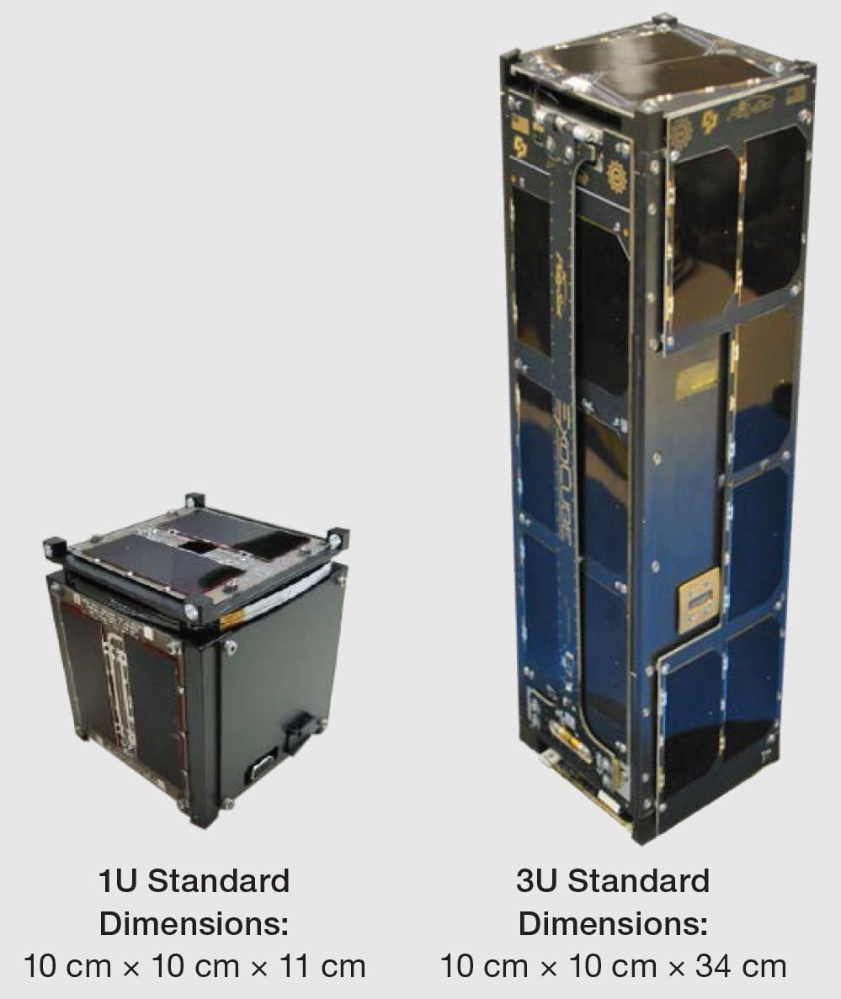

=====================================================
Concept of Operations (CONOPS)
=====================================================

.. dropdown:: Document Metadata

   :Document ID: SYS-OPS-001
   :Version: 1.0
   :Last Updated: July 2026

1. Mission Architecture & Parameters
====================================

1.1 Launch & Spacecraft Baseline
--------------------------------
* **Launch Window:** Q4 2028 - Q4 2030
* **Form Factor:** 3U `CubeSat <https://en.wikipedia.org/wiki/CubeSat>`_ standard :math:`10 \times 10 \times 34\text{ cm}`.
* **Target Orbit:** 400 km altitude, :math:`45^\circ` inclination

    
1.2 Mission Overview
--------------------
QSET is aiming to launch on Reaction Dynamics' first or second launch into Low Earth Orbit (LEO). Reaction Dynamics is a relatively new startup aiming to launch the first satellites into orbit from Canada. This will be QSET's first launch, and likely the first satellite in space launched from Canadian soil. 

1.2.1 What is this Mission?
~~~~~~~~~~~~~~~~~~~~~~~~~~~
The satellite will carry an **electrodynamic tether (EDT)** as its primary payload. 

For some physics background, an electrodynamic tether is essentially a long, conducting wire deployed from a spacecraft that leverages the fundamental laws of electromagnetism to alter its orbit without using chemical propellant. The system operates on three core physical principles:

* **Lorentz Force:** As the satellite travels through LEO at high orbital velocities (~7.5 km/s), the conducting tether cuts through Earth's geomagnetic field. The relative motion generates a motional electromotive force (EMF), driving an electrical current through the wire. The resulting force is governed by the Lorentz force equation:

  .. math::

     \vec{F} = I(\vec{L} \times \vec{B})

  Where :math:`I` is the current, :math:`\vec{L}` is the length vector of the tether, and :math:`\vec{B}` is Earth's magnetic field vector.

* **Ionospheric Interaction:** To complete the electrical circuit, the tether relies on the ambient plasma of Earth's ionosphere. A cathode on one end emits electrons into space, while the other end collects them from the plasma, creating a closed-loop current through the tether and the surrounding space environment.

* **Propulsion and Deorbiting:** The interaction between the induced current in the tether and Earth’s magnetic field generates a Lorentz force acting on the wire. When operating passively, this force acts in the direction opposite to the satellite's orbital velocity, serving as an electromagnetic brake. This allows for rapid, propellantless deorbiting, offering a groundbreaking solution to the growing issue of space debris.

By testing this payload, QSET aims to demonstrate a sustainable, highly efficient method for spacecraft maneuvering and end-of-life disposal in LEO.

1.2.2 Mission Objectives
~~~~~~~~~~~~~~~~~~~~~~~~
The mission aims to achieve both technical success and educational advancement:

* **Technical Objective:** Measure the electrical current generated through the tether and observe the corresponding orbital deceleration or movement resulting from the induced Lorentz force.
* **Educational Objective:** Train, educate, and cultivate critical skills within the student team for the space industry, empowering members to actively contribute to and lead this pivotal Canadian launch.

1.3 Mission Segment Overview
----------------------------
* **Space Segment:** The 3U CubeSat bus, integrated payloads, and deployable antenna systems.
* **Ground Segment:** The university ground station tracking array, software-defined radio (SDR) terminal networks, and automated scheduling clients.

---

1. Mission Lifecycles and Phases
================================

The mission lifecycle is broken into chronological phases tracking the satellite from development to disposal.

Phase 0: Integration & Launch
  The satellite is placed into the launch vehicle deployer pod. It remains completely powered down via physical deployment switches.

Phase 1: Deployment & Early Orbit (LEOP)
  The deployer releases the satellite. Switches close, booting the flight computer. A mandatory 30-minute radio silence window is executed before antenna deployment mechanisms are triggered.

Phase 2: Detumbling & Commissioning
  The Attitude Determination and Control System (ADCS) dampens rotational tip-off rates. Once stable, the On-Board Computer sequences health and diagnostic tests on all subteams.

Phase 3: Nominal Operations
  The primary mission phase. The satellite stabilizes into its target orientation, executes core payload deployment, and logs scientific and housekeeping data.

Phase 4: Ground Station Downlink
  During line-of-sight passes over the university ground station, the communications system switches to an active high-power transceiver state to download telemetry data.

Phase 5: Decommissioning / Disposal
  Atmospheric drag at 400 km naturally degrades the orbit over time. The spacecraft will passively re-enter the upper atmosphere and burn up completely.

---

1. Spacecraft Operational States (Modes)
========================================

Operational modes represent the software-driven states of the flight system at any given second. Mode transitions are governed automatically by system metrics or manual ground override commands.

Safe Mode
  * **Description:** Low-power baseline state designed for system survival. Payload and auxiliary data buses are entirely isolated.
  * **ADCS Action:** Slow passive sun-pointing to maximize solar panel surface exposure.
  * **Exit Criteria:** Main battery voltage rises and stabilizes above 3.8V for 3 consecutive orbits.

Nominal Mode (Idle/Science)
  * **Description:** Standard operational state. Subsystem health checks are continuously aggregated.
  * **ADCS Action:** Nadir (Earth-facing) pointing alignment active.
  * **Exit Criteria:** Automatic trigger via scheduled pass windows, or forced drop due to low battery safety thresholds.

Downlink Mode
  * **Description:** High-power RF transceivers active on beacon triggers over known geographical footprints.
  * **Power Constraints:** Heavily constrained by the system power budget; limited to 10-minute automated windows per pass.

---

4. Ground Segment Operations
============================

4.1 Ground Pass Strategy
------------------------
* **Pass Window Calculation:** Automated Two-Line Element (TLE) tracking updates pulled from orbital registries every 24 hours.
* **Tracking Automation:** The university ground station tracking software automatically commands the Yagi/Parabolic antenna array once the satellite passes above 10 degrees elevation over the horizon.

4.2 Data Handling and Distribution
----------------------------------
* **Raw Processing:** Decoded packet binaries are ingested directly into a secure central database.
* **Parsing:** Ground servers unpack raw frames using schemas documented in the **ICD**, routing live metrics directly to the engineering subteam dashboard clients.

---

5. Document Control & Revisions
===============================

.. list-table:: Revision History
   :widths: 15 15 45 25
   :header-rows: 1

   * - Version
     - Date
     - Description
     - Author
   * - 1.0
     - 2026-07-04
     - Initial baseline finalized with launch window and orbit geometries.
     - Systems Engineering Lead