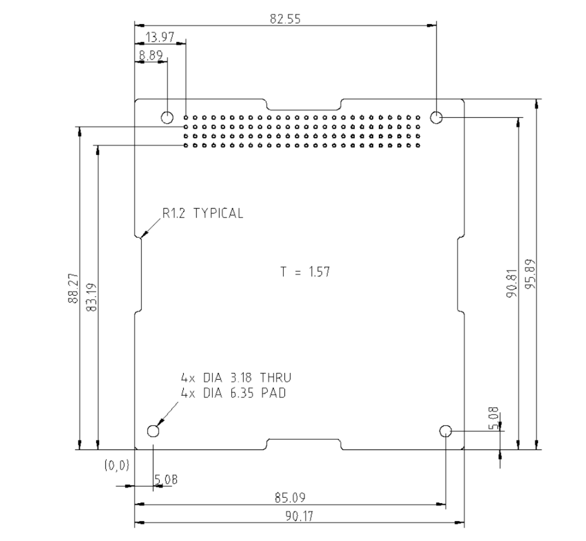

=====================================================
Interface Control Document (ICD)
=====================================================

.. dropdown:: Document Metadata

   :Version: 0.1
   :Last Updated: July 2026
   :Status: Baseline

1. Document Scope & Purpose
===========================

This document serves as the binding physical, electrical, and logical contract between all CubeSat subsystems. Any modification to a boundary, pinout, packet structure, or power characteristic defined within this document requires a formal System Change Request and approval from all affected subteam managers.

---

2. Mechanical & Structural Interfaces
=====================================

2.1 Main Bus Form Factor Constraints
------------------------------------
All internal subsystem printed circuit boards (PCBs) must comply with the standard PC104 form factor constraints to stack properly within the structural chassis.

* **Maximum Component Height (Top of PCB):** 8.5 mm
* **Maximum Component Height (Bottom of PCB):** 2.0 mm
* **Standard Board Dimensions:** 90.17 mm $\times$ 95.89 mm
* **Structural Mounting Standoffs:** M3 x 15mm aluminum threaded spacers

2.2 Payload Mechanical Clearance Envelope
------------------------------------------
The payload subsystem occupies the top U of the stack. It must maintain a minimum clear buffer distance of **5.0 mm** from the internal deployment switch rails on the +Z face of the chassis to prevent mechanical interference with launcher deployment tabs.

---

.. role:: raw-html(raw)
   :format: html

3. Electrical Interfaces & Power Characteristics
================================================

3.1 Master PC104 Bus Pin Allocations
------------------------------------
Power rails, telemetry buses, and control interfaces are routed across subsystems using a standardized 104-pin stackthrough architecture comprising two 52-pin headers (**H1** and **H2**).

Table 1: Header Pin Layout (H1 & H2)
~~~~~~~~~~~~~~~~~~~~~~~~~~~~~~~~~~~~

.. raw:: html

   

      CANFD Bus
      UART FPGA
      SPI Bus A
      UART MCU
      I2C Bus B
      I2C Bus A
      GND
      OBC 3.3V
      ADCS 3.3V
      ADCS 5.0V
      BATT 3.3V
      SW1 / SW2 VBAT
      MPPT VBAT
      Payload VBAT
      Comms VBAT
      OBC VBAT
      Health / INT
   

   

   <table class="pc104-grid-table">
     <tbody>
       <!-- H2 Even Pins (Top) -->
       <tr>
         <th rowspan="2" class="header-label">H2</th>
         <td>2</td><td>4</td><td>6</td><td>8</td><td>10</td>
         <td class="badge-vbat-gold" title="Pin 12: SW1_VBAT (Selectable Input Power)">12</td>
         <td>14</td><td>16</td><td>18</td><td>20</td>
         <td class="badge-health" title="Pin 22: EPS_INT (EPS/Battery to OBC)">22</td>
         <td class="badge-health" title="Pin 24: BATT_INT (OBC to Battery)">24</td>
         <td class="badge-mppt-health" title="Pin 26: EPS_OBC_3V3_HEALTH (MPPT to OBC Health)">26</td>
         <td class="badge-gnd" title="Pin 28: GND">28</td>
         <td class="badge-gnd" title="Pin 30: GND">30</td>
         <td class="badge-gnd" title="Pin 32: GND">32</td>
         <td class="badge-vbat-mppt" title="Pin 34: MPPT_VBAT (MPPT Power)">34</td>
         <td class="badge-gnd" title="Pin 36: GND">36</td>
         <td>38</td>
         <td class="badge-gnd" title="Pin 40: GND">40</td>
         <td class="badge-vbat-payload" title="Pin 42: PAYLOAD_VBAT (Payload Power)">42</td>
         <td class="badge-gnd" title="Pin 44: GND">44</td>
         <td class="badge-vbat-comms" title="Pin 46: COMMS_VBAT (Comms Power)">46</td>
         <td class="badge-gnd" title="Pin 48: GND">48</td>
         <td class="badge-vbat-obc" title="Pin 50: OBC_VBAT (OBC Input Power)">50</td>
         <td class="badge-gnd" title="Pin 52: GND">52</td>
       </tr>
       <!-- H2 Odd Pins (Bottom) -->
       <tr>
         <td>1</td><td>3</td><td>5</td><td>7</td><td>9</td>
         <td class="badge-vbat-brown" title="Pin 11: SW2_VBAT (Selectable Input Power)">11</td>
         <td>13</td><td>15</td><td>17</td><td>19</td><td>21</td><td>23</td><td>25</td>
         <td class="badge-gnd" title="Pin 27: GND">27</td>
         <td class="badge-gnd" title="Pin 29: GND">29</td>
         <td class="badge-gnd" title="Pin 31: GND">31</td>
         <td class="badge-vbat-mppt" title="Pin 33: MPPT_VBAT (MPPT Power)">33</td>
         <td class="badge-gnd" title="Pin 35: GND">35</td>
         <td>37</td>
         <td class="badge-gnd" title="Pin 39: GND">39</td>
         <td class="badge-vbat-payload" title="Pin 41: PAYLOAD_VBAT (Payload Power)">41</td>
         <td class="badge-gnd" title="Pin 43: GND">43</td>
         <td class="badge-vbat-comms" title="Pin 45: COMMS_VBAT (Comms Power)">45</td>
         <td class="badge-gnd" title="Pin 47: GND">47</td>
         <td class="badge-vbat-obc" title="Pin 49: OBC_VBAT (OBC Input Power)">49</td>
         <td class="badge-gnd" title="Pin 51: GND">51</td>
       </tr>
       <!-- H1 Even Pins (Top) -->
       <tr class="header-sep">
         <th rowspan="2" class="header-label">H1</th>
         <td class="badge-can" title="Pin 2: CAN_B_L (CANFD Bus B Low)">2</td>
         <td class="badge-can" title="Pin 4: CAN_B_H (CANFD Bus B High)">4</td>
         <td class="badge-uart-dark" title="Pin 6: UART_D_TO_BUS (FPGA-PL)">6</td>
         <td class="badge-uart-dark" title="Pin 8: UART_D_FROM_BUS (FPGA-PL)">8</td>
         <td class="badge-spi" title="Pin 10: SPI_A_MOSI (SPI Bus A)">10</td>
         <td class="badge-spi" title="Pin 12: SPI_A_MISO (SPI Bus A)">12</td>
         <td>14</td><td>16</td><td>18</td><td>20</td>
         <td class="badge-uart-blue" title="Pin 22: UART_B_TO_BUS (MCU)">22</td>
         <td class="badge-uart-blue" title="Pin 24: UART_B_FROM_BUS (MCU)">24</td>
         <td class="badge-gnd" title="Pin 26: GND">26</td>
         <td class="badge-rail-3v3-obc" title="Pin 28: OBC_3V3 (OBC Power)">28</td>
         <td class="badge-gnd" title="Pin 30: GND">30</td>
         <td class="badge-rail-3v3-adcs" title="Pin 32: ADCS_3V3 (ADCS Power)">32</td>
         <td class="badge-gnd" title="Pin 34: GND">34</td>
         <td class="badge-rail-5v-adcs" title="Pin 36: ADCS_5V (ADCS Power)">36</td>
         <td class="badge-gnd" title="Pin 38: GND">38</td>
         <td>40</td>
         <td class="badge-gnd" title="Pin 42: GND">42</td>
         <td>44</td>
         <td class="badge-gnd" title="Pin 46: GND">46</td>
         <td class="badge-rail-3v3-batt" title="Pin 48: BATT_3V3 (Battery Power)">48</td>
         <td class="badge-gnd" title="Pin 50: GND">50</td>
         <td class="badge-gnd" title="Pin 52: GND">52</td>
       </tr>
       <!-- H1 Odd Pins (Bottom) -->
       <tr>
         <td class="badge-can" title="Pin 1: CAN_A_L (CANFD Bus A Low)">1</td>
         <td class="badge-can" title="Pin 3: CAN_A_H (CANFD Bus A High)">3</td>
         <td class="badge-uart-dark" title="Pin 5: UART_C_TO_BUS (FPGA-PS)">5</td>
         <td class="badge-uart-dark" title="Pin 7: UART_C_FROM_BUS (FPGA-PS)">7</td>
         <td class="badge-spi" title="Pin 9: SPI_A_CS (SPI Bus A)">9</td>
         <td class="badge-spi" title="Pin 11: SPI_A_CLK (SPI Bus A)">11</td>
         <td class="badge-uart-blue" title="Pin 13: UART_A_TO_BUS (MCU)">13</td>
         <td class="badge-uart-blue" title="Pin 15: UART_A_FROM_BUS (MCU)">15</td>
         <td>17</td><td>19</td>
         <td class="badge-i2c-yellow" title="Pin 21: I2C_B_SCL (I2C Bus B)">21</td>
         <td class="badge-i2c-yellow" title="Pin 23: I2C_B_SDA (I2C Bus B)">23</td>
         <td class="badge-gnd" title="Pin 25: GND">25</td>
         <td class="badge-rail-3v3-obc" title="Pin 27: OBC_3V3 (OBC Power)">27</td>
         <td class="badge-gnd" title="Pin 29: GND">29</td>
         <td class="badge-rail-3v3-adcs" title="Pin 31: ADCS_3V3 (ADCS Power)">31</td>
         <td class="badge-gnd" title="Pin 33: GND">33</td>
         <td class="badge-rail-5v-adcs" title="Pin 35: ADCS_5V (ADCS Power)">35</td>
         <td class="badge-gnd" title="Pin 37: GND">37</td>
         <td>39</td>
         <td class="badge-i2c-purple" title="Pin 41: I2C_A_SDA (I2C Bus A)">41</td>
         <td class="badge-i2c-purple" title="Pin 43: I2C_A_SCL (I2C Bus A)">43</td>
         <td class="badge-gnd" title="Pin 45: GND">45</td>
         <td class="badge-rail-3v3-batt" title="Pin 47: BATT_3V3 (Battery Power)">47</td>
         <td class="badge-gnd" title="Pin 49: GND">49</td>
         <td class="badge-gnd" title="Pin 51: GND">51</td>
       </tr>
     </tbody>
   </table>
   

Table 2: Master PC104 Pin Mapping
~~~~~~~~~~~~~~~~~~~~~~~~~~~~~~~~~

.. list-table:: Master PC104 Header Pinout Details
   :widths: 10 10 25 40 15
   :header-rows: 1

   * - Header
     - Pin
     - Name
     - Description
     - Nominal Voltage (V)
   * - :raw-html:`H1`
     - 1
     - ``CAN_A_L``
     - CANFD Bus A (Low Signal)
     - -5 to 5
   * - :raw-html:`H1`
     - 2
     - ``CAN_B_L``
     - CANFD Bus B (Low Signal)
     - -5 to 5
   * - :raw-html:`H1`
     - 3
     - ``CAN_A_H``
     - CANFD Bus A (High Signal)
     - -5 to 5
   * - :raw-html:`H1`
     - 4
     - ``CAN_B_H``
     - CANFD Bus B (High Signal)
     - -5 to 5
   * - :raw-html:`H1`
     - 5
     - ``UART_C_TO_BUS``
     - UART Connected to FPGA-PS
     - 0 to 3.3
   * - :raw-html:`H1`
     - 6
     - ``UART_D_TO_BUS``
     - UART Connected to FPGA-PL
     - 0 to 3.3
   * - :raw-html:`H1`
     - 7
     - ``UART_C_FROM_BUS``
     - UART Connected to FPGA-PS
     - 0 to 3.3
   * - :raw-html:`H1`
     - 8
     - ``UART_D_FROM_BUS``
     - UART Connected to FPGA-PL
     - 0 to 3.3
   * - :raw-html:`H1`
     - 9
     - ``SPI_A_CS``
     - SPI Bus A, Chip Select
     - 0 to 3.3
   * - :raw-html:`H1`
     - 10
     - ``SPI_A_MOSI``
     - SPI Bus A, Controller Out, Peripheral In
     - 0 to 3.3
   * - :raw-html:`H1`
     - 11
     - ``SPI_A_CLK``
     - SPI Bus A, Clock
     - 0 to 3.3
   * - :raw-html:`H1`
     - 12
     - ``SPI_A_MISO``
     - SPI Bus A, Controller In, Peripheral Out
     - 0 to 3.3
   * - :raw-html:`H1`
     - 13
     - ``UART_A_TO_BUS``
     - UART From MCU
     - 0 to 3.3
   * - :raw-html:`H1`
     - 15
     - ``UART_A_FROM_BUS``
     - UART From MCU
     - 0 to 3.3
   * - :raw-html:`H1`
     - 21
     - ``I2C_B_SCL``
     - I2C Bus B, Clock
     - 0 to 3.3
   * - :raw-html:`H1`
     - 22
     - ``UART_B_TO_BUS``
     - UART From MCU
     - 0 to 3.3
   * - :raw-html:`H1`
     - 23
     - ``I2C_B_SDA``
     - I2C Bus B, Data
     - 0 to 3.3
   * - :raw-html:`H1`
     - 24
     - ``UART_B_FROM_BUS``
     - UART From MCU
     - 0 to 3.3
   * - :raw-html:`H1`
     - 25-26
     - ``GND``
     - Ground
     - 0
   * - :raw-html:`H1`
     - 27-28
     - ``OBC_3V3``
     - OBC Power Rail
     - 3.3
   * - :raw-html:`H1`
     - 29-30
     - ``GND``
     - Ground
     - 0
   * - :raw-html:`H1`
     - 31-32
     - ``ADCS_3V3``
     - ADCS Power Rail
     - 3.3
   * - :raw-html:`H1`
     - 33-34
     - ``GND``
     - Ground
     - 0
   * - :raw-html:`H1`
     - 35-36
     - ``ADCS_5V``
     - ADCS Power Rail
     - 5.0
   * - :raw-html:`H1`
     - 37-38
     - ``GND``
     - Ground
     - 0
   * - :raw-html:`H1`
     - 41
     - ``I2C_A_SDA``
     - I2C Bus A, Data
     - 0 to 3.3
   * - :raw-html:`H1`
     - 42
     - ``GND``
     - Ground
     - 0
   * - :raw-html:`H1`
     - 43
     - ``I2C_A_SCL``
     - I2C Bus A, Clock
     - 0 to 3.3
   * - :raw-html:`H1`
     - 45-46
     - ``GND``
     - Ground
     - 0
   * - :raw-html:`H1`
     - 47-48
     - ``BATT_3V3``
     - Battery Board Power Rail
     - 3.3
   * - :raw-html:`H1`
     - 49-50
     - ``GND``
     - Ground
     - 0
   * - :raw-html:`H1`
     - 51-52
     - ``GND``
     - Ground
     - 0
   * - :raw-html:`H2`
     - 11
     - ``SW2_VBAT``
     - Selectable Input Power
     - 5.5 to 30
   * - :raw-html:`H2`
     - 12
     - ``SW1_VBAT``
     - Selectable Input Power
     - 5.5 to 30
   * - :raw-html:`H2`
     - 22
     - ``EPS_INT``
     - Interrupt Line (EPS / Battery Board to OBC)
     - 0 to 3.3
   * - :raw-html:`H2`
     - 24
     - ``BATT_INT``
     - Interrupt Line (OBC to Battery Board)
     - 0 to 3.3
   * - :raw-html:`H2`
     - 26
     - ``EPS_OBC_3V3_HEALTH``
     - MPPT Board to OBC 3.3V Line Health Indicator
     - 0 to 3.3
   * - :raw-html:`H2`
     - 27-28
     - ``GND``
     - Ground
     - 0
   * - :raw-html:`H2`
     - 29-30
     - ``GND``
     - Ground
     - 0
   * - :raw-html:`H2`
     - 31-32
     - ``GND``
     - Ground
     - 0
   * - :raw-html:`H2`
     - 33-34
     - ``MPPT_VBAT``
     - MPPT Board Power Rail
     - 5.5 to 30
   * - :raw-html:`H2`
     - 35-36
     - ``GND``
     - Ground
     - 0
   * - :raw-html:`H2`
     - 39-40
     - ``GND``
     - Ground
     - 0
   * - :raw-html:`H2`
     - 41-42
     - ``PAYLOAD_VBAT``
     - Payload Power Rail
     - 5.5 to 30
   * - :raw-html:`H2`
     - 43-44
     - ``GND``
     - Ground
     - 0
   * - :raw-html:`H2`
     - 45-46
     - ``COMMS_VBAT``
     - Main Comms Power Rail
     - 5.5 to 30
   * - :raw-html:`H2`
     - 47-48
     - ``GND``
     - Ground
     - 0
   * - :raw-html:`H2`
     - 49-50
     - ``OBC_VBAT``
     - OBC Input Power
     - 5.5 to 30
   * - :raw-html:`H2`
     - 51-52
     - ``GND``
     - Ground
     - 0

Table 3: Subsystem Power Matrix
~~~~~~~~~~~~~~~~~~~~~~~~~~~~~~~

.. list-table:: Subsystem Power Bus Distribution
   :widths: 25 25 25 25
   :header-rows: 1

   * - Subsystem
     - Gets 3V3?
     - Gets 5V?
     - Gets VBAT?
   * - **ADCS**
     - :raw-html:`&#10004;` H1 (31-32)
     - :raw-html:`&#10004;` H1 (35-36)
     - ---
   * - **BATT**
     - :raw-html:`&#10004;` H1 (47-48)
     - ---
     - ---
   * - **OBC**
     - :raw-html:`&#10004;` H1 (27-28)
     - ---
     - :raw-html:`&#10004;` H2 (49-50)
   * - **Payload**
     - ---
     - ---
     - :raw-html:`&#10004;` H2 (41-42)
   * - **Comms**
     - ---
     - ---
     - :raw-html:`&#10004;` H2 (45-46)
   * - **MPPT**
     - ---
     - ---
     - :raw-html:`&#10004;` H2 (33-34)

3.2 Subsystem Electrical Load Profiles
--------------------------------------
This section tracks the input hardware voltage tolerances and transient spikes that the Electrical Power System (EPS) regulators must accommodate.

.. list-table:: Subsystem Electrical Load Requirements
   :widths: 15 15 20 20 30
   :header-rows: 1

   * - Subsystem
     - Supply Rail
     - Max Continuous Current
     - Max Peak Current (Inrush)
     - Input Voltage Tolerance
   * - (OBC)
     - 3V3_SYS
     - 350 mA
     - 400 mA (Bootup spike)
     - $3.3\text{V} \pm 5\%$
   * - COMMS
     - 5V_SYS
     - 1.5 A (S-Band Transmit)
     - 2.8 A (PA Turn-on, <15ms)
     - $5.0\text{V} \pm 2\%$ (Low Ripple)
   * - ADCS
     - 3V3_SYS
     - 300 mA
     - 800 mA (Torquer Spike)
     - $3.3\text{V} \pm 10\%$
   * - PAYLOAD
     - 5V_SYS
     - 600 mA
     - 1.2 A (Sensor Initialization)
     - $5.0\text{V} \pm 5\%$

3.3 RF Feedline Coaxial Interface
---------------------------------
The connection between the COMMS transmitter board and the deployable antenna assembly must utilize an edge-mount **SMA Female connector** with a matched impedance of $50\ \Omega$.

---

4. Software & Logical Data Interfaces
=====================================

4.1 Shared I2C Addressing Architecture
--------------------------------------
To prevent bus contention, all peripherals connected to the primary :math:`\text{I}^2\text{C}` lines must utilize unique 7-bit software destination addresses.

* **Electrical Power System (EPS):** ``0x40``
* **Attitude Determination (ADCS):** ``0x42``
* **On-Board Computer (CDH):** ``0x44`` (Master Node)
* **Payload Controller:** ``0x46``

4.2 Standard Telemetry Packet Structure
---------------------------------------
All frames passed between subsystems over the internal data network must use the following unified 8-byte header block structure prior to appending payload bytes.

.. list-table:: Unified Telemetry Packet Header Schema
   :widths: 15 20 25 40
   :header-rows: 1

   * - Byte Offset
     - Field Name
     - Data Type
     - Description / Notes
   * - 0
     - START_BYTE
     - uint8_t
     - Fixed synchronization byte value (Always ``0xAA``)
   * - 1
     - ORIGIN_ID
     - uint8_t
     - Sender Subsystem identifier code (``0x01`` = CDH, ``0x02`` = EPS, ``0x03`` = COMMS, ``0x04`` = PL)
   * - 2-3
     - PACKET_ID
     - uint16_t
     - Monotonically increasing sequence count for packet loss tracking
   * - 4-5
     - LENGTH
     - uint16_t
     - Total length of trailing data payload bytes (Excludes this header)
   * - 6-7
     - HEADER_CRC
     - uint16_t
     - Modbus CRC-16 computation over bytes 0-5

---

5. Document Control & Revisions
===============================

.. list-table:: Revision History
   :widths: 15 15 45 25
   :header-rows: 1

   * - Version
     - Date
     - Description
     - Author
   * - 1.0
     - 2026-07-04
     - Unified physical, electrical, and logical baselines for CDH/EPS/COMMS.
     - Systems Engineering Lead